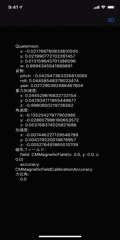

# AirPodsPro-Motion-Sampler

Code Examples of CMHeadphoneMotionManager in CoreMotion.

## Requirements 
 - Xcode: 12.0+
 - iOS  : 14.0+
 - iPhone, iPad (*1)
 - AirPods Pro(1st or 2nd generation) / AirPods Max / AirPods(3rd generation) or Beats Fit Pro

<small>*1: iPod Touch (7th generation) is not supported.</small>  
<small>*2: The necessary sensors are included, so it should work.</small>

## How To Build
Open ```AirPodsProMotion.xcodeproj``` on Xcode12 or later, then connect your iPhone or iPad to build it.  

 
## Contents
 
 |  <center> Infomation View </center> |  <center>Rotate the Cube <br> By Head Motion </center> | <center>Table scrolling <br> By Head Motion </center> | <center> Export motion data to CSV </center>|  
 | ---- | ---- | ---- | ---- |  
 |  <center> 　</center> | <center>  　</center> | <center>　　</center> | <center>　　</center> |  


- infomation View   
Displays the information (```CMDeviceMotion```) obtained from AirPodsPro.

- Rotate the Cube By Head Motion  
The cube rotates in sync with the orientation of the face.

- Tabel scrolling By Head Motion  
Move the face up and down to scroll the TableView.  
We don't use any hands at all.

- Export motion data to CSV  
Export the motion data acquired from AirpodsPro as a CSV file.  
You can check the data by using a ```file App```.  
For more information, a CSV file is stored in the 'Files App > On My iPhone > AirPodsPro' directory.

  
## Reference
 - [Apple Developer Documentation](https://developer.apple.com/documentation/coremotion/cmheadphonemotionmanager)


## Author
 Yoshio Tsukuda  
 - [HP](https://tukuyo.net/)
 - [Twitter](https://twitter.com/tukutuku_tukuyo)
